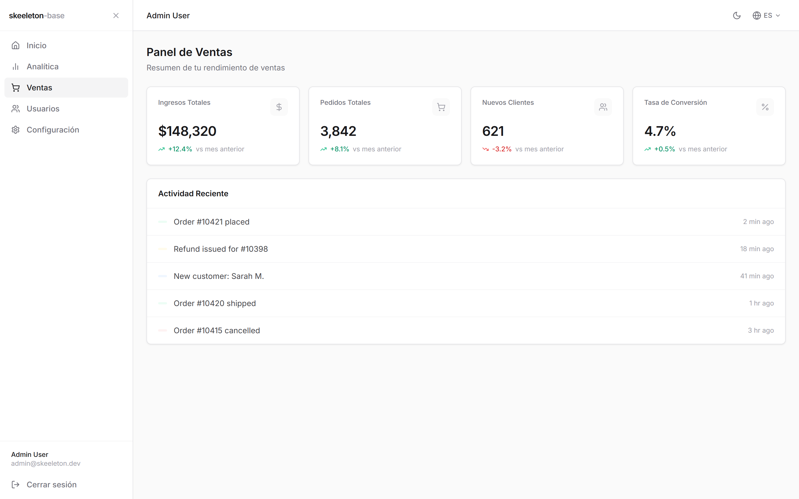
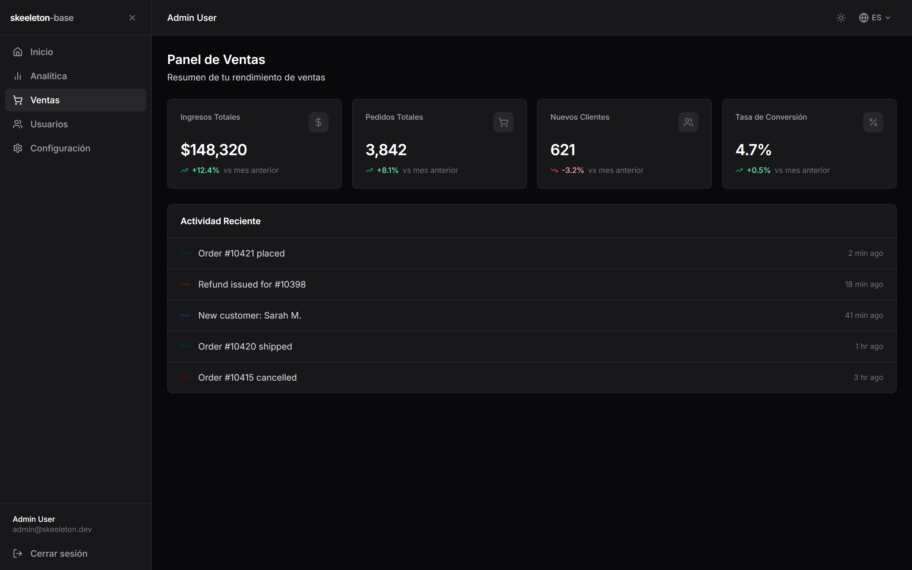
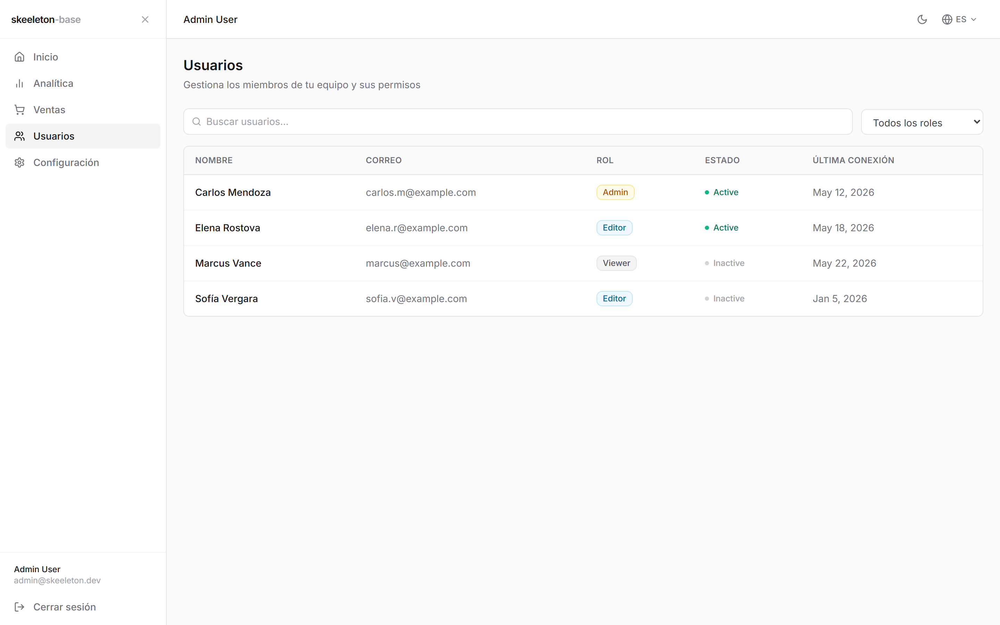
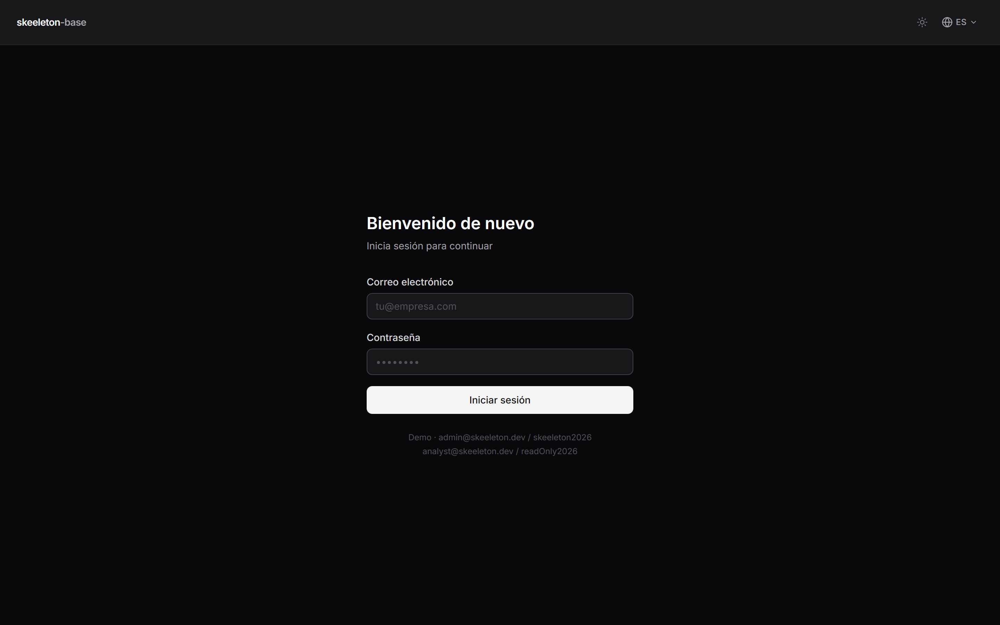

<div align="center">

# Skeeleton Base

**Production-ready React 18 admin dashboard scaffold.**
Auth, dark mode, i18n (4 languages), toasts, error boundaries and a clean
feature-based architecture — out of the box.

`React 18` · `Vite 5` · `TypeScript 5` · `Tailwind CSS 3` · `React Router 6` · `TanStack Query 5` · `i18next` · `Sonner`

**[🚀 Live demo](https://skeeleton-dashboard.vercel.app/auth/login)** · [Quick start](#quick-start) · [Architecture](#architecture) · [Documentation](SKEELETON.md)

</div>

---

<div align="center">

### Sales dashboard — light & dark




### Users & login




</div>

> [!TIP]
> Try it live at **[skeeleton-dashboard.vercel.app](https://skeeleton-dashboard.vercel.app/auth/login)**
> with the demo credentials below. Screenshots regenerate with
> `node scripts/capture-screenshots.mjs` (dev server must be running).

---

## Why Skeeleton Base?

Stop rebuilding the same boilerplate on every project. Skeeleton Base ships the
non-negotiable foundations of a modern admin panel so you can start with your
business logic on day one.

- 🔐 **Authentication** — mock auth with protected routes, ready to swap for a real API.
- 🌗 **Dark mode** — system-aware, no flash on load, persisted.
- 🌍 **i18n** — English, Spanish, French and Portuguese, with browser detection.
- 🔔 **Toasts** — one `useNotify()` hook, fully translated.
- 🛡️ **Error boundaries** — a crash in one feature never takes down the app.
- 🧩 **Feature-based architecture** — _Screaming Architecture_; the folders tell you what the app does.
- ⚡ **Mock data layer** — realistic API latency simulation; swap one function for your real backend.
- 🧰 **Tooling included** — ESLint 9, Prettier, Husky + lint-staged pre-commit hooks.
- 🖥️ **Optional NestJS backend** — JWT auth + Drizzle ORM starter in [`backend/`](backend/).

## Tech stack

| Layer        | Library                 | Version |
| ------------ | ----------------------- | ------- |
| UI framework | React                   | 18.3    |
| Build tool   | Vite                    | 5.4     |
| Language     | TypeScript              | 5.5     |
| Styling      | Tailwind CSS            | 3.4     |
| Routing      | React Router            | 6.26    |
| Server state | TanStack Query          | 5.56    |
| i18n         | i18next + react-i18next | 23 / 15 |
| Icons        | Lucide React            | 0.447   |
| Toasts       | Sonner                  | 2.0     |

## Quick start

**Requirements:** Node.js **18+**, npm **9+**.

```bash
# 1. Install dependencies
npm install

# 2. (optional) configure environment
cp .env.example .env

# 3. Start the dev server
npm run dev
```

The app runs at `http://localhost:5173`.

### Demo credentials (mock)

| Role       | Email                   | Password        |
| ---------- | ----------------------- | --------------- |
| SuperAdmin | `admin@skeeleton.dev`   | `skeeleton2026` |
| Viewer     | `analyst@skeeleton.dev` | `readOnly2026`  |

### Scripts

| Command             | Action                            |
| ------------------- | --------------------------------- |
| `npm run dev`       | Dev server with HMR               |
| `npm run build`     | Production build (`tsc` + Vite)   |
| `npm run preview`   | Preview the production build      |
| `npm run lint`      | Lint the whole project (ESLint 9) |
| `npm run format`    | Format the codebase with Prettier |
| `npm run typecheck` | Type-check without emitting       |

### Environment variables

| Variable            | Default | Description                                                   |
| ------------------- | ------- | ------------------------------------------------------------- |
| `VITE_API_BASE_URL` | `/api`  | Base URL for the HTTP client (`src/core/utils/apiClient.ts`). |

## Architecture

Skeeleton Base follows **Screaming Architecture**: the folder structure screams
_what the app does_, not _how it's built_.

```
src/
├── core/               # Shared infrastructure (not business logic)
│   ├── components/     # Reusable UI components
│   ├── hooks/          # Global utility hooks (useNotify)
│   ├── providers/      # React contexts (theme, etc.)
│   ├── i18n/           # i18next config + 4 locale files
│   └── utils/          # apiClient + centralized mock data
│
├── features/           # ★ Business logic lives here
│   ├── auth/           # Login + auth hook
│   ├── users/          # Users module (table, API, page)
│   └── sales/          # Sales dashboard
│
├── layout/             # App shell (sidebar + header)
├── routes/             # Router + protected-route guard
└── main.tsx            # Entry point
```

👉 **Full developer guide** (adding features, components, toasts, protecting
routes, swapping the mock layer for a real API) is in **[SKEELETON.md](SKEELETON.md)**.

## From mock data to a real API

Every feature reads from a centralized mock layer in `src/core/utils/mockData.ts`
through TanStack Query:

```ts
useQuery({ queryKey: ['users'], queryFn: () => simulateApiDelay(MOCK_USERS) })
```

To go live, swap the `queryFn` for a real call via `apiClient` — components stay
untouched. See [SKEELETON.md](SKEELETON.md) for the step-by-step guide.

## Optional backend

A NestJS + Drizzle + JWT starter lives in [`backend/`](backend/) with its own
README and `.env.example`. It is fully decoupled — use it, replace it with your
own API, or stick with the mock layer.

## License

Commercial software. Licensed, not sold — see [LICENSE](LICENSE). Redistribution
or resale of the source code is prohibited.

© 2026 whisgel. All rights reserved.
